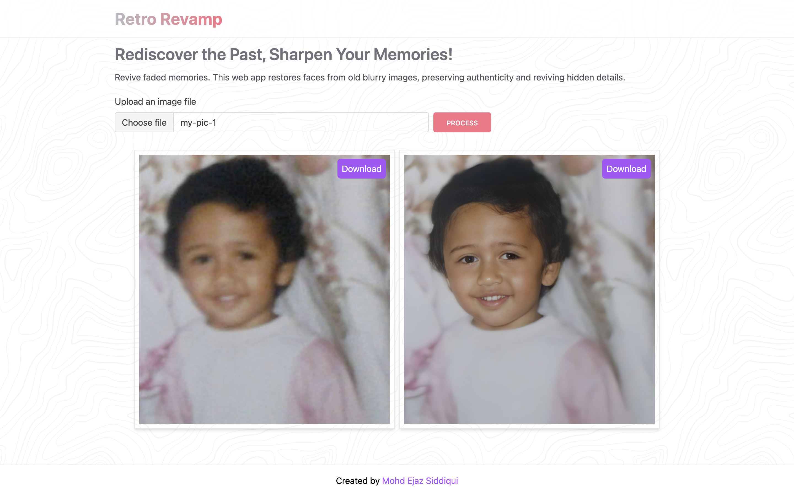

# Retro Revamp

  

Rediscover the Past, Sharpen Your Memories!

Revive faded memories. This web app restores faces from old blurry images, preserving authenticity and reviving hidden details.

This project uses the GFPGAN AI model to restore faces from blurry / old images. 

## Pre-requisites to run this project

1. AWS credentials and S3 bucket
2. Replicate API Token (replicate.com)

## Steps to run this project

1. Clone the repo
2. Run `npm install` to install all the dependencies
3. Create a `.env.local` from `env-example` file: `cp env-example .env.local`
4. Update the Keys/Tokens in the `.env.local` file
5. Run `npm run dev` to start the project

## Tech Stack:

- NextJS
- TailwindCSS
- AWS S3 for storing images
- GFPGAN AI model hosted at replicate.com

## Contact

mohdejazsiddiqui@gmail.com